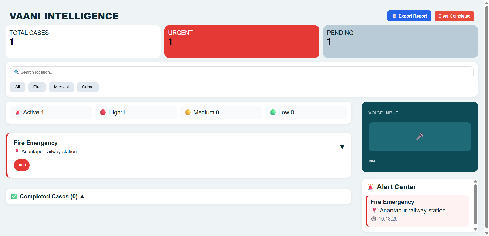
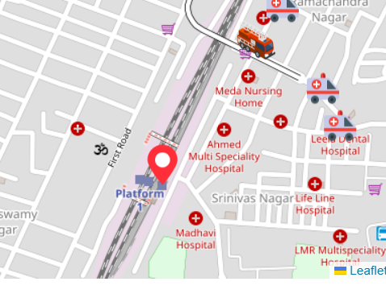
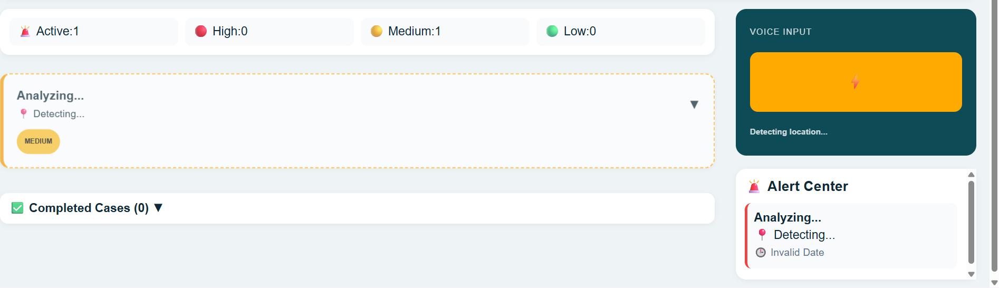
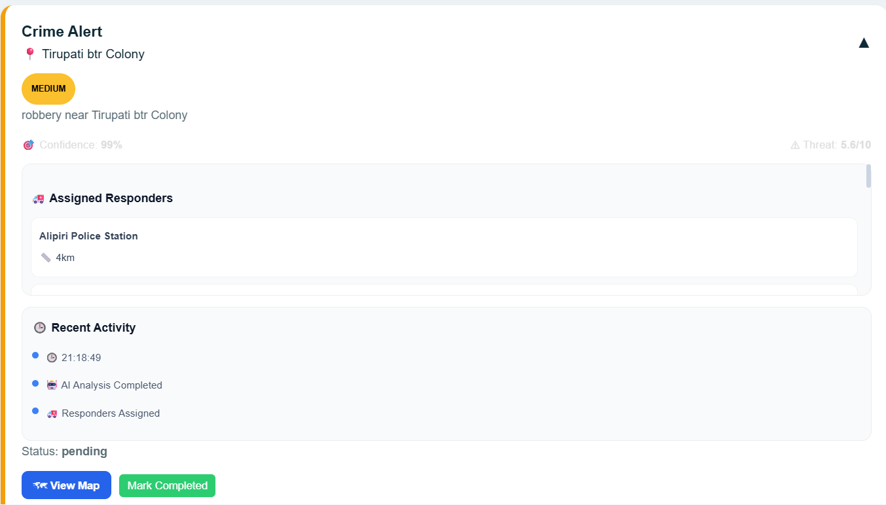

# VAANI INTELLIGENCE

### AI-Powered Emergency Response & Crisis Management System

## Overview

Vaani Intelligence is a full-stack emergency response platform that enables users to report incidents through voice input and automatically classifies emergencies using AI. The system assigns nearby responders, visualizes incidents on an interactive map, and provides real-time monitoring through a centralized dashboard.

The project aims to reduce emergency response time by combining voice recognition, AI analysis, geolocation, and real-time crisis tracking.

---

## Features

### Voice-Based Incident Reporting

- Converts voice input into text using Speech Recognition.
- Supports hands-free emergency reporting.

### AI-Powered Incident Classification

- Automatically identifies incident type:
  - Fire Emergencies
  - Medical Emergencies
  - Crime Incidents

- Generates severity levels:
  - High
  - Medium
  - Low

### Real-Time Dashboard

- Live incident monitoring.
- Active and completed case tracking.
- Severity-wise incident categorization.

### Interactive Map Visualization

- Displays incident locations on Leaflet Maps.
- Auto-focuses on newly reported incidents.
- Color-coded severity markers.

### Responder Assignment

- Assigns nearest responders based on incident type:
  - Hospitals & Ambulances
  - Fire Stations
  - Police Stations

- Displays responder locations on the map.

### Crisis Analytics

- Active case statistics.
- Severity distribution.
- Incident activity timeline.

---

## Tech Stack

### Frontend

- React.js
- Vite
- Axios
- React Leaflet
- Socket.IO Client

### Backend

- Node.js
- Express.js
- Socket.IO

### Database

- MongoDB
- Mongoose

### AI & Voice

- Speech Recognition API
- AI-based Incident Analysis

### Maps

- Leaflet
- OpenStreetMap

---

## System Architecture

User Voice Input
↓
Speech-to-Text
↓
AI Incident Analysis
↓
Severity Detection
↓
Responder Assignment
↓
MongoDB Storage
↓
Real-Time Dashboard Update
↓
Map Visualization

---

## Installation

### Clone Repository

```bash
git clone https://github.com/akhil2328/vaani
cd vaani
```

### Backend Setup

```bash
cd backend
npm install
```

Create a .env file:

```env
MONGO_URI=your_mongodb_connection_string
AI_API_KEY=your_api_key
PORT=5000
```

Start backend:

```bash
npm start
```

### Frontend Setup

```bash
cd frontend
npm install
npm run dev
```

---

## Usage

1. Start backend server.
2. Start frontend application.
3. Open the dashboard.
4. Report incidents through voice input.
5. View AI-generated analysis.
6. Monitor responder assignments and incident locations.

---

## Future Enhancements

- Cloud Deployment
- Mobile Application
- SMS Emergency Alerts
- Predictive Risk Analysis
- Multi-language Voice Support
- Advanced AI Threat Assessment

---

## Screenshots

### Dashboard



### Map View



### Voice Reporting



### Responder Tracking

## 

## Author

Chandra Akhileshwar Reddy

GitHub: https://github.com/akhil2328

---

### Academic Project | Full Stack Development | AI-Powered Emergency Response System
